# Datos por dirección

1. **Dirección 1**: Japón → camino al circuito  
2. **Dirección 2**: Japón → camino al centro  
3. **Dirección 3**: Japón → camino a la rotonda  
4. **Dirección 4**: Iturbe → camino a la playa

## Análisis del dataset completo

### Distribucion del dataset 

Se procede a mostrar 

1. Total de los datos registrados ya etiquetados.
2. Total de registros por dia de la semana.
3. Total de registros por direccion.

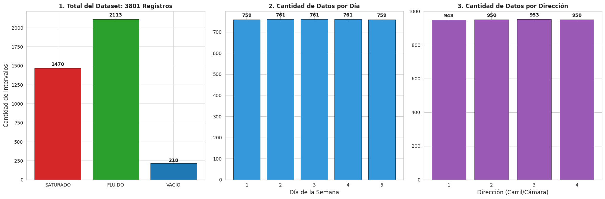

#### Conclucion
------ Falta ------

---

### Análisis de los 3 grupos

Centroide de cada grupo

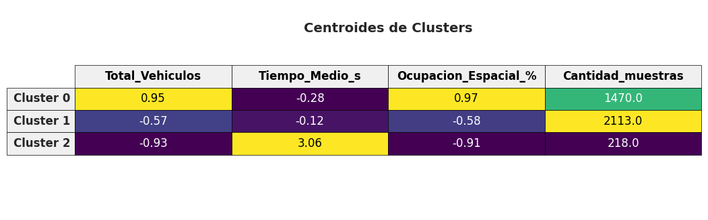

**Cluster 0:**  
- **Vehiculos:** 0.95 - alto  
- **Tiempo medio entre autos:** - 0.28 - bajo  
- **Ocupacion:** 0.97 - alto  
- **Cantidad:** 1.470  

Se puede observar que en este cluster el flujo vehicular es muy alto, los vehículos circulan muy cercanos entre sí debido al reducido tiempo medio entre vehículos, y la ocupación del carril es casi completa. Este cluster corresponde a tráfico pesado, donde se ocupa gran parte del carril y los vehículos avanzan de forma densa.

**Cluster 1:**  
- **Vehiculos:** -0.57 - moderado/bajo  
- **Tiempo medio entre autos:** -0.12 - moderado/bajo  
- **Ocupacion:** -0.58 - moderado/bajo  
- **Cantidad:** 2.113  

En este cluster se observa un tráfico moderado, con menos vehículos que el Cluster 0. El tiempo medio entre vehículos es ligeramente bajo, lo que indica un flujo continuo pero sin saturación. La ocupación del carril es parcial, lo que permite cierto espacio entre vehículos y una circulación más fluida.

**Cluster 2:**  
- **Vehiculos:** -0.93 - bajo  
- **Tiempo medio entre autos:** 3.06 - alto  
- **Ocupacion:** -0.91 - bajo  
- **Cantidad:** 218  

Este cluster representa tráfico ligero. La cantidad de vehículos es baja, el tiempo medio entre ellos es alto, y la ocupación del carril es mínima. Se corresponde a periodos de baja densidad de tráfico, donde los vehículos circulan con amplio espacio.

**Distribucion de los cluster** 

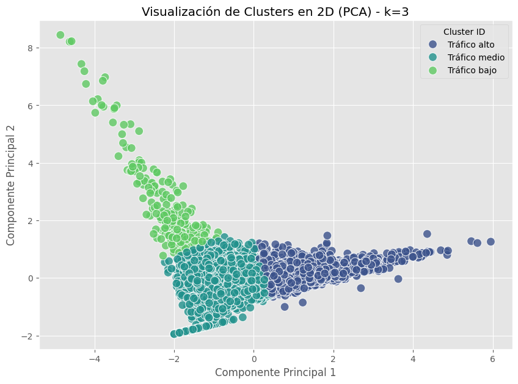

---

### Distribucion de los datos por dia y direccion

Se procede a mostrar

La distribucion de la etiquetas encontradas con la tecnica de cluster, en las diferentes secciones y dias 

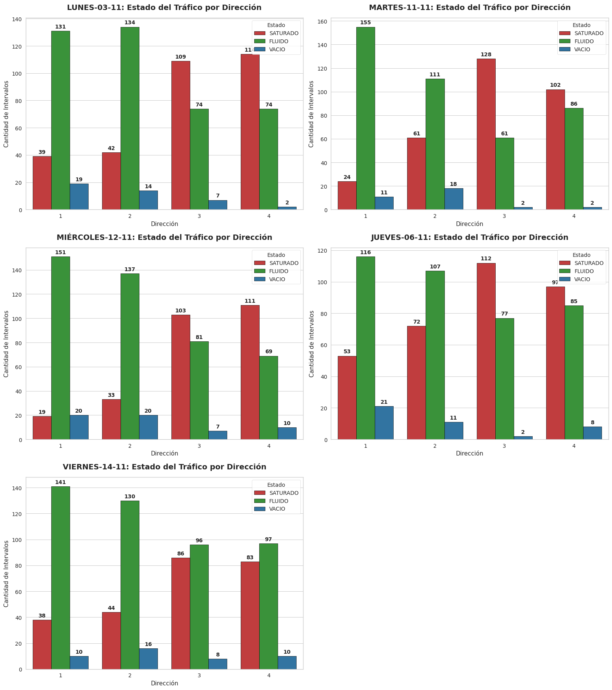

#### Analisis 
------ falta ------

#### Distribucion cluster por dia y direccion

**Direccion**

**Cluster de las cuatro direcciones**

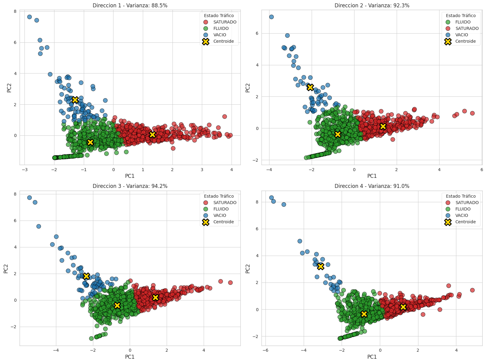

**Centroides de las cuatro direcciones**

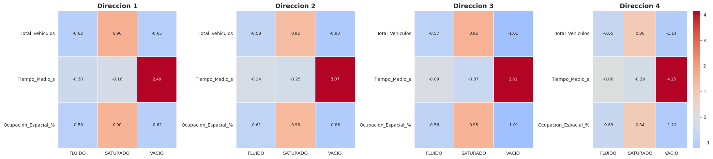

**Dia**

**Cluster de los cinco dias**

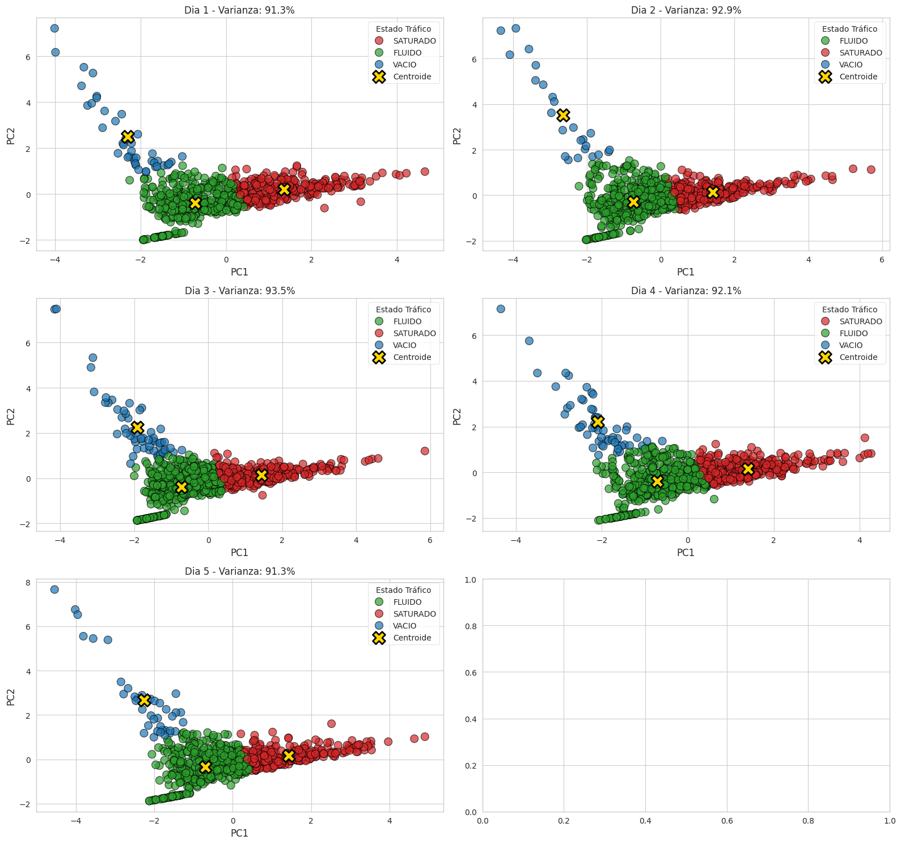

**Centroides de los cinco dias**

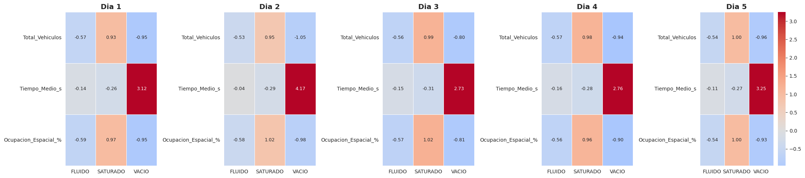

---

### Distribucion de los datos por dia, hora y direccion

Se muestra una imagen correspondiente al ida y en los pixeles se puede ver las direcciones, el tamaño de los pixeles es de 10 minutos.

**1. Dia lunes 03-11-2025**

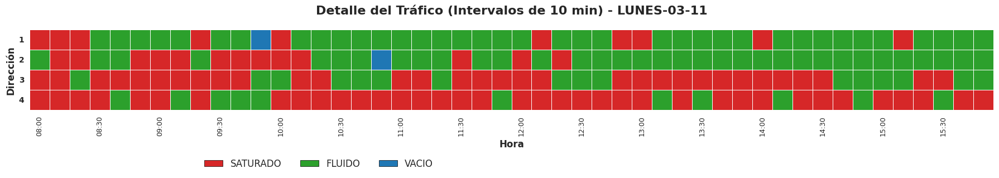

**2. Dia martes 11-11-2025**

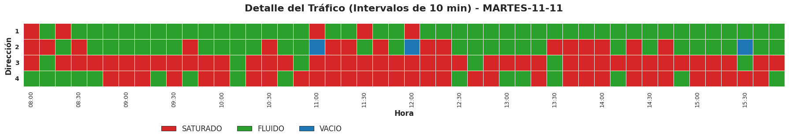

**3. Dia miercoles 12-11-2025**

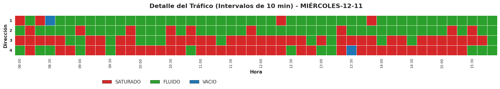

**4. Dia juevez 06-11-2025**

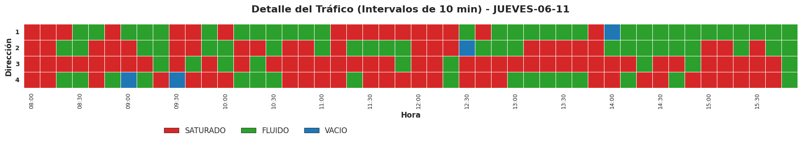

**5. Dia viernes 14-11-2025**

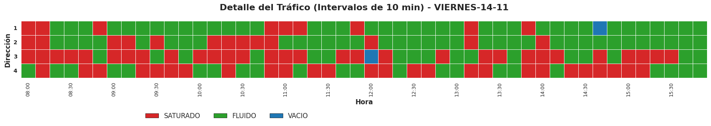

