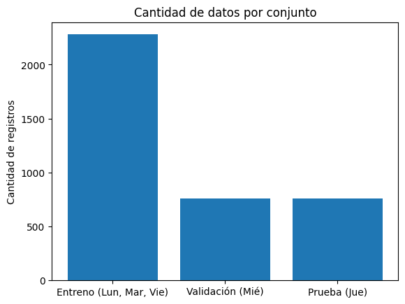

# Análisis final

## Etapa 1: Encontramos el tiempo óptimo por ciclo

Primeramente, preparamos los datos que ya habíamos obtenido del dataset anterior (aplicando técnicas de **clustering**) y realizamos un cálculo fila por fila. Esto tiene el fin de agregar una columna adicional de "tiempo óptimo" por cada ciclo. Por ejemplo: para 14 vehículos, el tiempo óptimo en que pasarían sería 40 segundos; para 5 vehículos, sería 22 segundos. Se agrega a cada fila para tener un punto de referencia.

#### Explicación de la fórmula utilizada

Se implementan dos pasos para hallar este resultado:

**Paso 1: Calcular el Tiempo Base**  
Dependiendo del nivel de tráfico (**Cluster**), se elige un nivel de confianza para asegurar que la mayoría de los vehículos alcancen a pasar:

- **Tráfico Pesado (C=0):** Se cubre el 95%.
- **Tráfico Medio (C=1):** Se cubre el 75%.
- **Tráfico Ligero (C=2):** Se cubre el 50%.

*¿Por qué no usamos, por ejemplo, el percentil 100%? Porque podría corresponder a un dato anómalo; por ejemplo, un pico de 30 vehículos cuando el 95% de las veces el flujo es de 14.*

**Fórmula:**  
> **T_base** = Vehículos detectados * Tiempo promedio vehículo

**Paso 2: Aplicar Ajustes y Límites**

Al tiempo base se le suma un **margen de seguridad de 3 segundos**. El resultado final debe estar dentro de un rango lógico (entre 20 y 60 segundos).

*Esto se aplica por estándares: si es menor a 20 s, sería muy poco tiempo para un semáforo; si supera los 60 s, el tiempo de espera para las otras direcciones sería excesivo.*

**Fórmula Compacta:**  
> **T_óptimo** = clip( **T_base** + 3, [20, 60] )

---

#### Ejemplo Práctico

Si tenemos los siguientes datos en una zona de **Tráfico Pesado (C=0)**:

- **Vehículos:** 14.2  
- **Tiempo entre autos:** 3.6 s  

1. **Multiplicación:**  
   >14.2 x 3.6 = 51.12 seg.
2. **Suma de margen:**  
   >51.12 + 3 = 54.12 seg.  
3. **Resultado:**  
   Como está en el rango [20, 60], el tiempo final es **54.12 s**.

---

## Etapa 2: Adición de características

En esta fase se realizó un proceso en donde se añadieron nuevas columnas al dataset en base a los datos ya existentes, esto para ayudar al modelo a aprender mejor.

Siendo que Random Forest es poderoso, pero necesita información relevante.

Se añadieron variables de alto valor predictivo.

A continuación se listan las variables añadidas y ordenadas por el tipo de variable.

### 1. Variable Temporal

Para ayudar al modelo a entender los patrones cíclicos de la ciudad, extraemos información tiempo:

- **Hora en Minutos:** Convertimos el formato `HH:MM:SS` a un valor lineal (0 a 1440), esto para ayudar al algoritmo.

### 2. Variables de Memoria

Para que el algoritmo tenga memoria o contexto del ciclo anterior aprovechando la naturaleza ordenada y dependiente de los registros, se implementaron variables de retraso y promedios para capturar esta inercia:

- **Lags:** Registramos el número de vehículos y la ocupación del ciclo anterior.
- **Media últimos 3 ciclos:** Promediamos los últimos 3 ciclos para suavizar variaciones atípicas y detectar la carga real.
- **Tendencia:** Calculamos la diferencia de vehículos entre el ciclo actual y el anterior para saber si el tráfico está subiendo o bajando.

### 3. Métricas de Eficiencia y Capacidad

Introducimos conceptos de ingeniería de tráfico para evaluar el rendimiento del semáforo:

- **Capacidad Teórica:** Define cuántos vehículos *podrían* pasar en el tiempo de verde asignado.  
### 3. Métricas de Eficiencia y Capacidad

Introducimos conceptos de ingeniería de tráfico para evaluar el rendimiento del semáforo:

- **Capacidad Teórica:** Define cuántos vehículos *podrían* pasar en el tiempo de verde asignado.  
> **Capacidad** = Tiempo de Verde / Tiempo Medio entre autos


- **Saturación Actual:** Es la relación entre los autos detectados y los que el semáforo realmente puede manejar.  
> **Saturación** = Vehículos Observados / Capacidad Teórica
---

## Resumen de Nuevas Características

| Categoría     | Variables Generadas                                   | Propósito                              |
|---------------|-------------------------------------------------------|----------------------------------------|
| **Tiempo**    | `Hora_Minutos`                                        | Ubicación temporal del evento.         |
| **Histórico** | `Total_Vehiculos_lag1`, `Media_Movil_3ciclos`        | Capturar la inercia del tráfico.       |
| **Dinámica**  | `Tendencia_Vehiculos`                                 | Detectar si la fila está creciendo.    |
| **Rendimiento** | `Capacidad_Teórica`, `Saturación_Actual`           | Medir la eficiencia del sistema.       |

---

### Resultado del Proceso

Al finalizar esta etapa, obtenemos un dataset enriquecido donde cada fila contiene el contexto histórico y técnico necesario para que el modelo aprenda a predecir el **Tiempo Óptimo** con mayor precisión.

---

## Etapa 3: Preparación y División de Datos

En esta fase, transformamos el dataset enriquecido en estructuras que el modelo de Machine Learning pueda procesar, asegurando una evaluación realista mediante una división temporal.

### 1. Selección de variables a pasar al modelo

En esta etapa se suman las nuevas variables más las variables básicas y se pasan al modelo los siguientes datos que creemos que son de suma importancia:

- Vehículos  
- Ocupación  
- Tiempos medios  
- Hora del día  
- Día de la semana  
- Dirección  
- Lags históricos  
- Medias móviles  
- Tendencias de tráfico  
- Niveles de saturación

### 2. Estrategia de División Temporal

En esta sección realizamos una división de los datos por día de la semana de la siguiente manera:

* **Entrenamiento:** Días Lunes, Martes y Viernes. Es la base de conocimiento del modelo.  
* **Validación:** Día Miércoles. Se usa para ajustar los hiperparámetros y evitar el sobreajuste (overfitting).  
* **Prueba:** Día Jueves. Datos que el modelo nunca ha visto, simulando su desempeño en un entorno real futuro.

---

## Estructura de las Matrices

| Conjunto | Propósito | Días Incluidos |
| :--- | :--- | :--- |
| **X_entreno, y_entreno** | Aprendizaje de patrones | Lunes, Martes y Viernes |
| **X_val, y_val** | Ajuste y monitoreo | Miércoles |
| **X_prueba, y_prueba** | Evaluación final (ciega) | Jueves |

---

### Objetivo de la Fase

Se garantiza que el modelo sea evaluado por su capacidad de **generalizar** el comportamiento del tráfico en días distintos a los de su entrenamiento.

### Datos totales

La distribución de los datos agregados es la siguiente:



---

## Fase 4: Optimización con PSO

En esta fase, utilizaremos PSO para encontrar la configuración óptima y de mejor rendimiento para el Random Forest, utilizando la técnica de medición MSE alcanzado para validar el camino correcto.

### Parámetros que estamos optimizando

El PSO busca el valor ideal dentro de estos rangos y estos son los resultados obtenidos:

| Hiperparámetro | Resultado | Descripción |
| :--- | :--- | :--- |
| `n_estimators` | 180 | Cantidad de árboles que componen el bosque. |
| `max_depth` | 21 | Profundidad máxima de cada árbol (controla la complejidad del modelo). |
| `min_samples_split` | 5 | Número mínimo de muestras necesarias para dividir un nodo interno. |
| `min_samples_leaf` | 1 | Número mínimo de muestras que debe contener una hoja terminal. |
| `max_features` | log2 | Proporción de variables consideradas en cada división del árbol. |
| `random_state` | 42 | Asegura que los resultados del entrenamiento sean reproducibles. |
| `n_jobs` | -1 | Utiliza todos los núcleos del procesador disponibles para acelerar el entrenamiento. |

---

## FASE 5: Modelo Random Forest

En esta fase implementamos nuestro modelo predictivo ya con la configuración obtenida con el PSO. Utilizamos el algoritmo Random Forest para establecer un punto de comparación inicial antes de aplicar otras optimizaciones.

### Configuración del Modelo

Iniciamos con la configuración obtenida anteriormente (se puede detallar en la tabla anterior).

### Evaluación de Métricas

Para saber qué tan bueno es nuestro modelo base, comparamos sus predicciones contra los valores reales del conjunto de validación usando tres métricas clave:

* **MAE (Error Absoluto Medio)**  
* **RMSE (Raíz del Error Cuadrático Medio)**  
* **R² (Coeficiente de Determinación)**

#### Resultados de las métricas de evaluación

```
MAE: 0.51 segundos
RMSE: 0.75 segundos
R²: 0.9885
```

- **MAE:** 0.51 segundos  

En promedio, el modelo se equivoca por **0.51 segundos**, es excelente, es un error mínimo.

- **RMSE:** 0.75 segundos  

El RMSE es más alto que el MAE, lo que indica que hay algunos errores más grandes ocasionales; sigue siendo muy bajo y confirma alta precisión.

- **R²:** 0.98 

El modelo explica el **98% de la variabilidad** en los datos, es casi perfecto.

- **MAPE:** 1.72%

Esto indica que el algoritmo tiende a fallar poco.


## Resultados Optenidos

A continuación se detallan los tiempos propuestos por el algoritmo desarrollado:

| Dirección | Propuesta (s) | Diferencia con anterior |
| :--- | :--- | :--- |
| `Dirección 1` | 26 | -7 s (-24.2%) |
| `Dirección 2` | 26 | -7 s (-21.2%) |
| `Dirección 3` | 32 | -1 s (-3.0%) |
| `Dirección 4` | 27 | -6 s (-18.2%) |

*Anterior mente estaba definido en 33 segundos*

