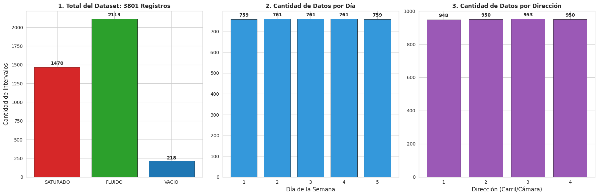

# Datos por dirección

1. **Dirección 1**: Japón → camino al circuito  
2. **Dirección 2**: Japón → camino al centro  
3. **Dirección 3**: Japón → camino a la rotonda  
4. **Dirección 4**: Japón → camino a la playa

## Análisis del dataset completo

### Distribucion del dataset 

Se procede a mostrar 

1. Total de los datos registrados ya etiquetados.
2. Total de registros por dia de la semana.
3. Total de registros por direccion.

#### Conclucion
------ aca camila ------

---